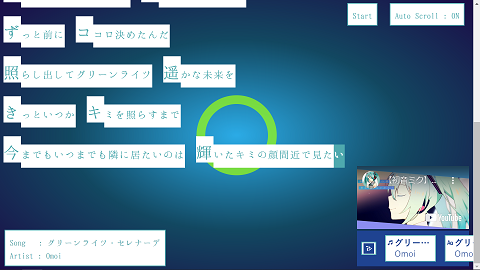

# TextAlive - 初音ミク「マジカルミライ2020」プログラミングコンテスト
# 作品名：コンピュータ入力のような表現(Expression like computer input) 
# 作成者：茜 瑠璃

## 動かし方
特殊なツールは用いていないので，Webブラウザ上で普通に動かすことができます。

## 実際の動き
[こちら](https://youtu.be/Odnl8fD425U)でデモ動画がで確認できます。

## 工夫した部分
発声中の文字と発生後の文字の差別化
* 発声中の文字と発生後の文字の色と背景色を反転させました。
* 「コンピュータで入力 => ボーカロイドの発声」と考えたときに，「ボーカロイドの発声 => 文字の表示はコンピュータでの入力に近い表現」にしてみてはどうか，と考えて実装しました。

オートスクロールの実装
* どんどん下に文字が増えていくため，スクロールしなければ新しい文字が見えなくなっていきます。
* オートスクロールを実装することで，見ている人が操作せずとも最後まで動画，音声，文字を楽しめるようになっています。
* オートスクロールをOFFにもできるので，好きな歌詞をずっと見ていたい，というときにも対応しています。

背景の円の表示
* テンポに合わせて円が中心から外側へと表示されます。
* サビとサビ以外での色を分けることで，見ている人の盛り上がり方に影響が出るのではないか，と考えて実装しました。
* サビのときの円の色はミクのイメージである「緑」を採用しています。

全体の配色
* 背景は前面の文字や動画より目立ちにくいやや暗めの配色ながら，単調にならないように中心に向けて少し明るくなるようにグラデーションをかけてあります。
* 文字の色はミクのイメージである「緑」を使っています。他の曲でも使うことを考えて，サビの時の円よりやや暗めの緑を使っています。
フレーズの先頭の文字の表現
* フレーズの先頭が分かりやすいように少し文字を大きくし，背景の白も後に続く文字より高くなるようにしてあります。

## 改善できたらよかった部分
曲の終了後にリプレイ
* 現状だと，リプレイするために再読み込みするしか方法がないので，もう一度見たい，と思った時の手間がかかります。

* 速いフレーズへの対応
文字の表示が速すぎると，画面上に表示されない文字が出てしまいます。
([参考](https://youtu.be/1-JXM9RuBew))

## 作ってみての感想など
* 正直，Javascriptは初心者だったので，慣れるまで大変でした。
* 慣れてしまえば色々な表現がプログラミングでできるのは楽しい！もっとやってみたい！となりました。
* あれもできれば，これもできれば，……なんていうのは野暮ですが，今できる精一杯を詰め込んでみました。
* 来年もプログラミングコンテストがあったら是非参加してみたいです。（それまでにレベルアップが必須なので頑張ります。）
